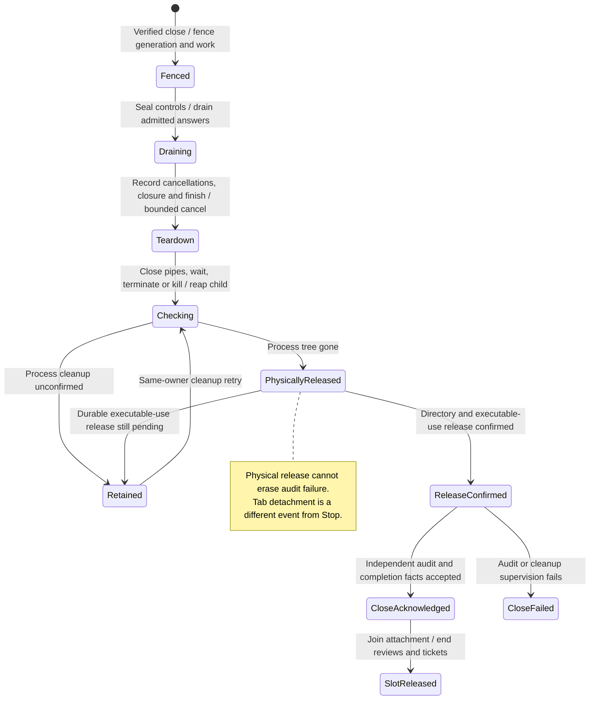

# Stop cancels owned work and confirms process cleanup

Stop blocks new work, cancels waiting or active inputs and closes the current agent connection. Saved history remains for later reopening. Archive only changes list visibility; closing a populated tab only detaches its view.

Physical process cleanup, release of installed-runtime use and audit delivery are separate results. A repeated close can retry unfinished cleanup. Delete additionally asks the provider to dispose of its session and erases Nessa-owned data. A provider may archive or retain its record, so local erasure must not be presented as proof that every external copy was deleted.

## Further reading

[Source](../../../../../src/conversation/adapters/store/slice.ts) · [Related source](../../../../../crates/nessa-server/src/conversation/application/provider_sessions.rs) · [Related tests](../../../../../crates/nessa-sdk/tests/infrastructure/process.rs)
