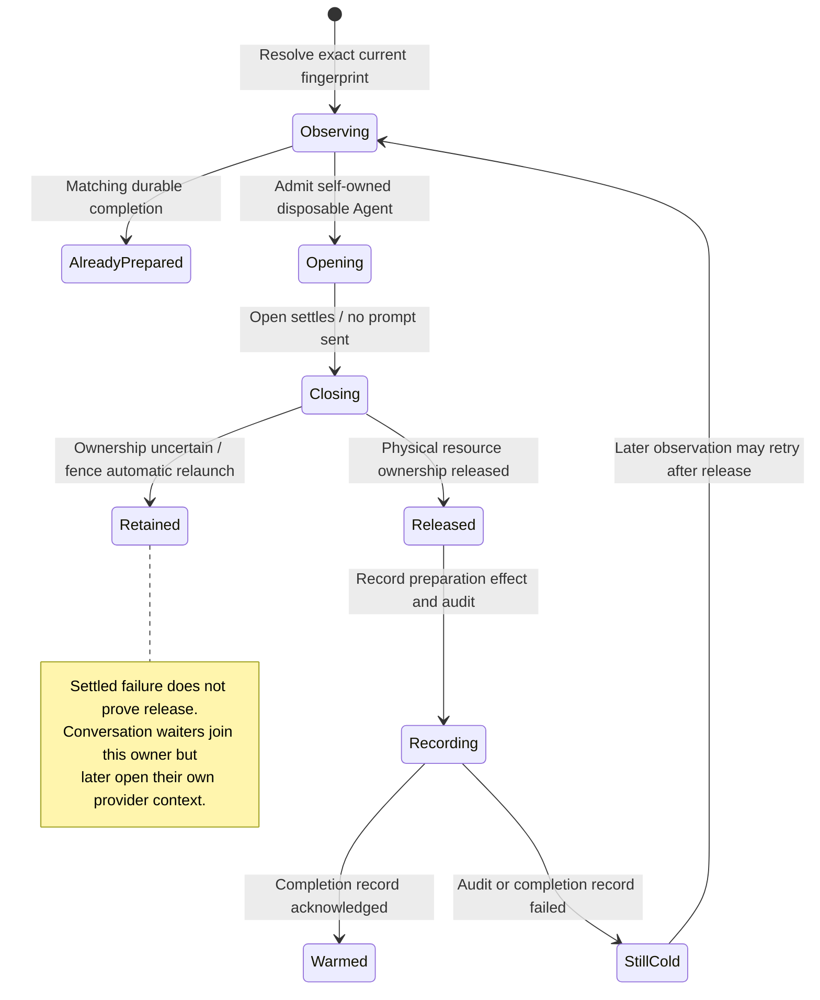

# the first agent launch is warmed in the background

Nessa can prepare the first agent launch by opening and closing a disposable session without sending a prompt. A conversation arriving during this warm-up joins the existing run rather than starting another.

Warm-up is separate from the conversation's own result. Process release, saved audit and completion-record delivery can succeed or fail independently. Another automatic launch must wait when the previous run may still hold resources.

## Further reading

[Source](../../../../../crates/nessa-server/src/agent_warm_up/application/service.rs) · [Related source](../../../../../crates/nessa-server/src/agent_warm_up/application/terminal.rs) · [Related tests](../../../../../crates/nessa-server/tests/agent_warm_up/service.rs)
