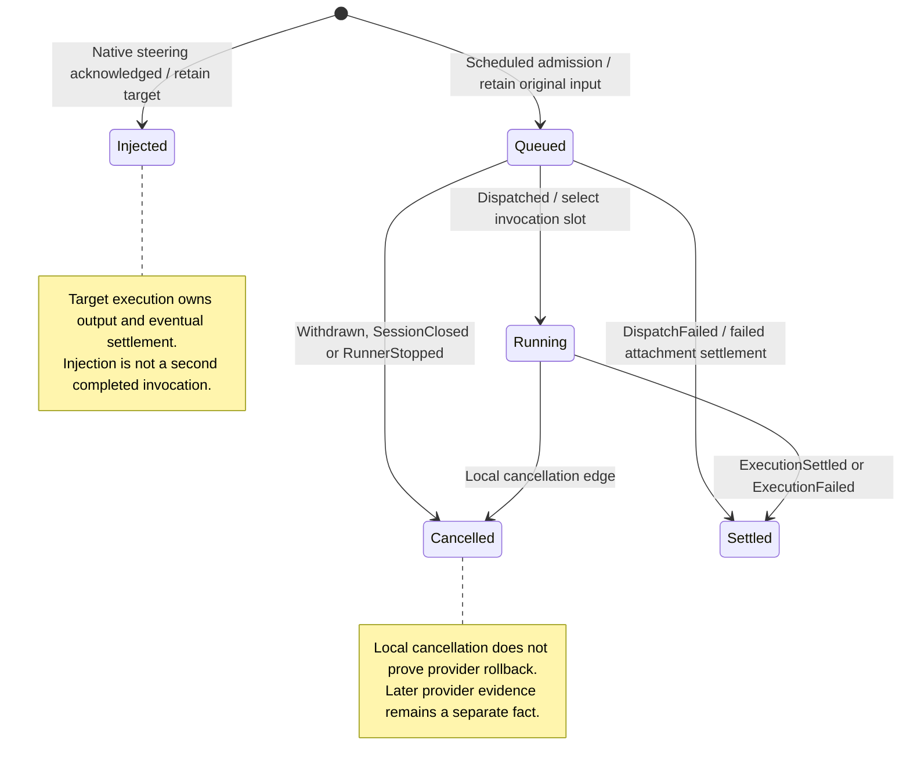

# Submission scheduling and recovery

Nessa keeps each accepted input's original ID, content, caller and delivery mode. Up to 64 inputs can wait while the agent is busy or starting. Boundary steering gets priority over ordinary waiting inputs without interrupting active work. For example, it can put your correction ahead of ordinary follow-ups once the current invocation finishes.

Retrying the same input can join its existing receipt or recover a retained result. Changing its content, caller or mode conflicts with that identity. If previous delivery cannot be safely resolved, Nessa refuses replay. Native steering falls back only when the agent explicitly confirms it did not consume the input; a timeout does not authorize fallback.

## Further reading

[Source](../../../../crates/nessa-sdk/src/domain/agent_execution/executions/value_objects/scheduling.rs) · [Related source](../../../../crates/nessa-sdk/src/application/agent_execution/agents/scheduling.rs) · [Related tests](../../../../crates/nessa-sdk/tests/application/agent_execution/scheduling/retries.rs)
