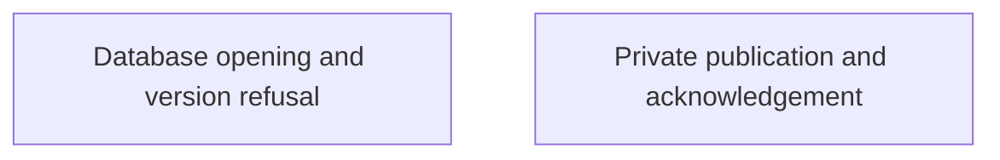

# Private local persistence

Nessa needs to save private files and open its local database safely. These pages show what is checked and what a failed operation can leave behind.

A replaced file can be visible before the final durability check succeeds. An unsupported database format is refused without automatic repair.

## Owner map

These boxes open related pages. They are parts of the system, rather than mutually exclusive runtime states.

## Browse this area

- [Database opening and version refusal](storage-database.md)
- [Private publication and acknowledgement](storage-publication.md)
