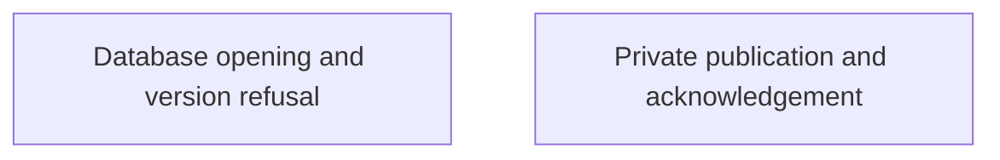
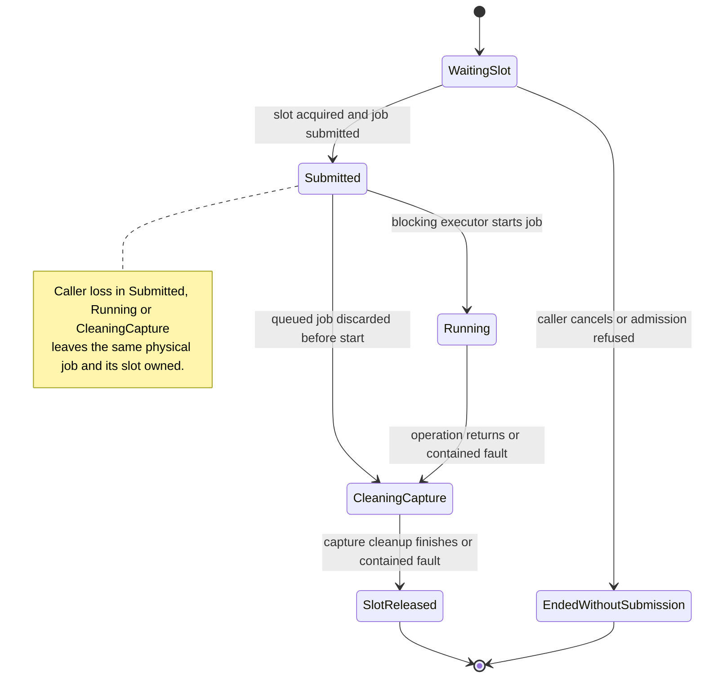

# Private local persistence

Nessa needs to save private files and open its local database safely. These pages show what is checked and what a failed operation can leave behind.

A replaced file can be visible before the final durability check succeeds. An unsupported database format is refused without automatic repair.

## Owner map

These boxes open related pages. They are parts of the system, rather than mutually exclusive runtime states.

## Browse this area

- [Database opening and version refusal](storage-database.md)
- [Private publication and acknowledgement](storage-publication.md)

## Physical adapter work

This chart follows one operation of a SQLite ownership store, OAuth file records
adapter or authorization audit adapter. Each instance admits one physical job.
Its slot stays owned through blocking-pool waiting, synchronous I/O and captured
input cleanup, including when the async caller disappears. Waiting callers have
not submitted a job or cloned their borrowed large input.

Physical admission does not establish crash durability or decide coordinator and
OAuth owner state. Constructors remain synchronous. The database-opening and
private-publication pages above describe their own storage components; OAuth
sealed-file persistence keeps its existing separate publication contract.

`Submitted` includes a job queued in the blocking pool. Operation interruption
and captured-input cleanup faults still pass through cleanup before slot release.
The awaiting caller receives the adapter's conservative typed failure: SQLite
`Uncertain`, records `Unavailable`, secret publication or deletion `Unknown`, or
an audit failure. These results do not prove rollback or absence. Successful
result delivery is separate from physical release; a dropped caller receives no
result, and output destruction after the job returns is outside this slot lifetime, whether
delivered or discarded after caller loss.

A first poll without a Tokio runtime is refused before effects. Admission captures
the originating executor before waiting, so a queued future may resume on a plain
thread. Reliable progress requires that executor to remain alive. There is no
cross-instance serialization or shutdown-drain promise. Faults during the physical
operation's own guard unwind can still abort the process. Audit JSON and newline
remain separate writes, so interruption can leave a partial line.

The [ordering table](../../../design/bounded-physical-persistence.md) owns the
cases and enforcing tests. Coordinator snapshot revisions and OAuth generation,
reply and settlement decisions retain their existing application authority.

### Further reading

- [Physical persistence design and evidence](../../../design/bounded-physical-persistence.md)
- [SQLite ownership adapter](../../../../crates/nessa-sdk/src/infrastructure/session_storage/ownership.rs)
- [Actual cancellation and cleanup tests](../../../../crates/nessa-sdk/src/infrastructure/session_storage/ownership/tests.rs)
