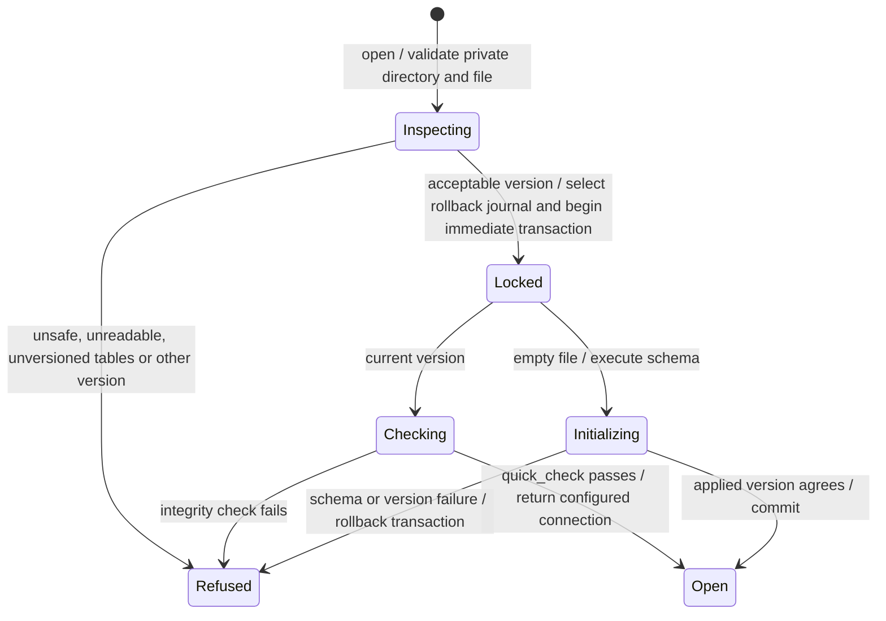

# Database opening and version refusal

Nessa opens its private database only when the file and format are acceptable. It checks the schema version before changes that could affect the database.

An unsupported version is preserved rather than silently migrated or repaired. A private file path alone does not prove every platform permission guarantee. This page follows database opening, not the lifetime of every row stored in it.

## Further reading

[Source](../../../../crates/nessa-local-database/src/lib.rs)
