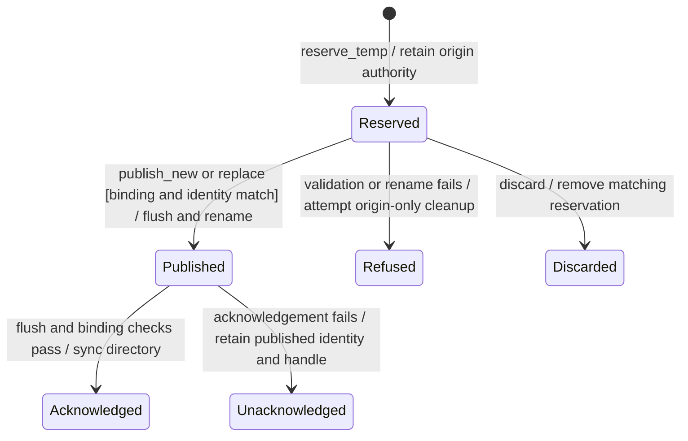

# Private publication and acknowledgement

Publishing here means putting a prepared private file at its intended location. Nessa first prepares and syncs the file, replaces the destination, then confirms the containing directory was synced.

The new file can already be visible when a later sync fails. Error therefore does not mean nothing changed. Cleanup has its own result and must not remove a newer publication. Platform limits remain part of the storage contract.

## Further reading

[Source](../../../../crates/nessa-local-storage/src/retained_directory.rs)
