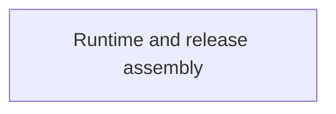

# Build and release tooling

Developer tooling prepares tested agent versions and assembles release artifacts. These are build and publication operations, rather than running product services.

A complete build manifest does not prove the release was signed, uploaded or installed successfully.

## Owner map

These boxes open related pages. They are parts of the system, rather than mutually exclusive runtime states.

## Browse this area

- [Runtime and release assembly](tooling-runtime.md)
