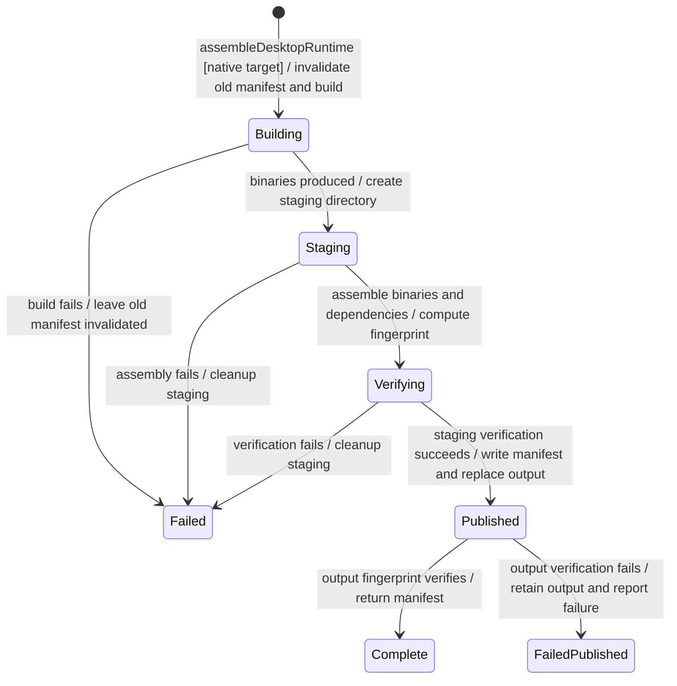
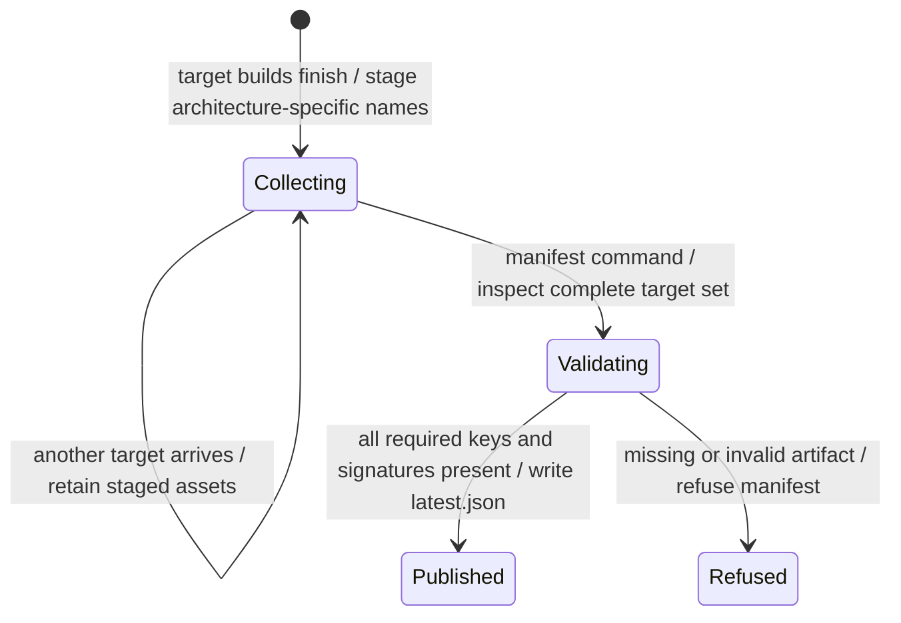

# Runtime and release assembly

Build tooling prepares the tested agent artifacts and assembles releases for each target. It validates the files before publishing the release manifest.

Preparing new output invalidates stale output instead of treating it as a fresh build. A complete manifest means all required target artifacts were assembled. It does not prove signing, upload, installation or a user's successful update. Some replacement steps are not atomic, so a failed build can leave partial output to inspect.

## Further reading

[Source](../../../../scripts/desktop/prepare-runtime.mjs) · [Related source](../../../../scripts/desktop/prepare-node.mjs)
