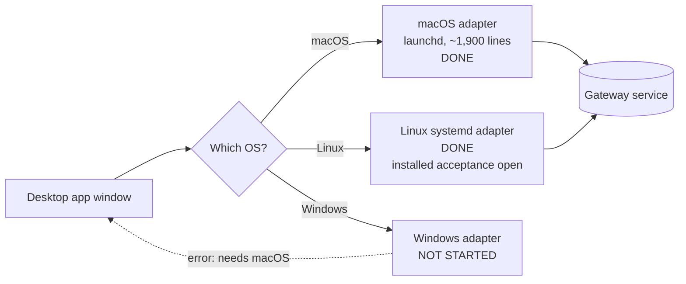
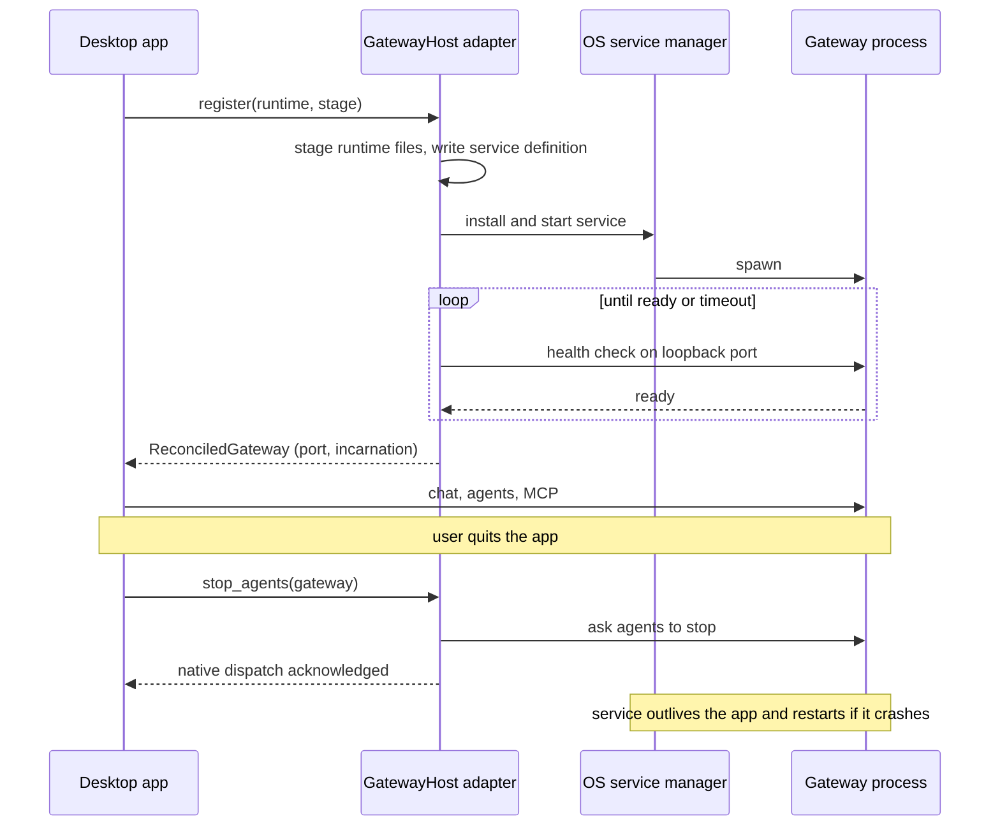
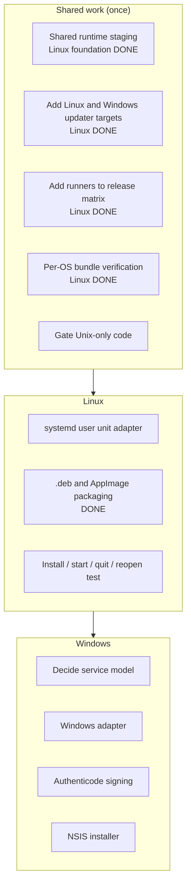
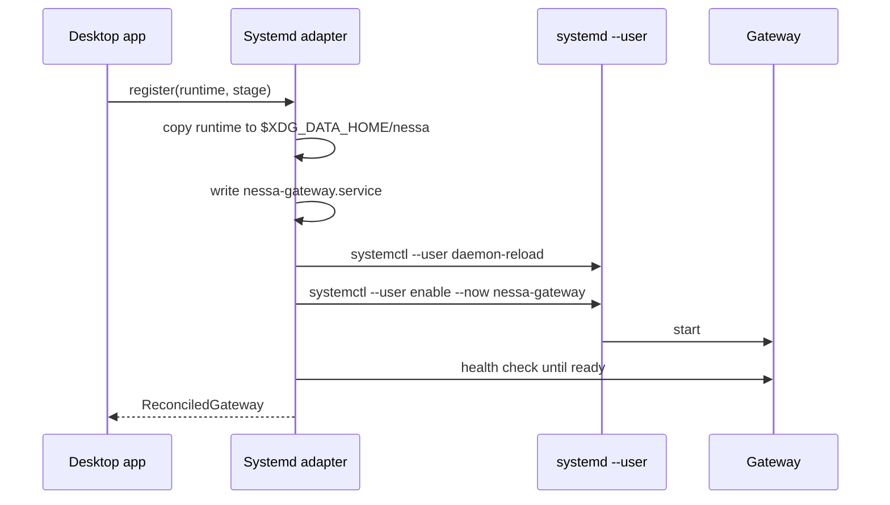
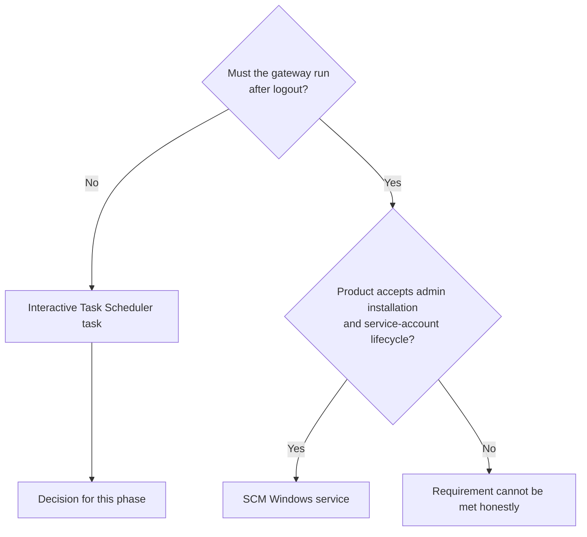
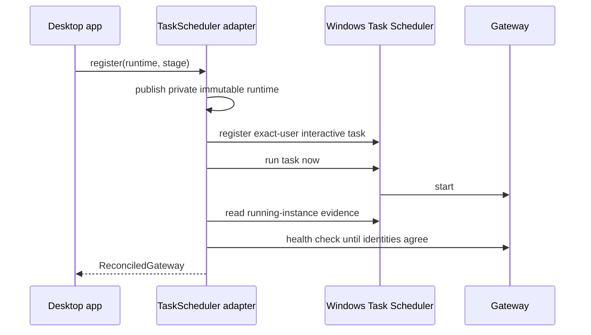

# Plan: ship the desktop app on Linux and Windows

Status: TODO. macOS is done. Linux x86_64 runtime assembly and its systemd user
service adapter are implemented and exercised in CI; installed logout/login,
packaging, and release remain TODO. The Windows service model is recorded below;
[#205](https://github.com/nessalabs/nessa-agent/issues/205) owns its native model
proof before adapter implementation. Linux installed acceptance remains tracked
by [#188](https://github.com/nessalabs/nessa-agent/issues/188).

This plan is written in plain language so anyone on the team can follow it.
Diagrams use Mermaid and render on GitHub.

## 1. Where we are today

The desktop app opens on all three systems. macOS and Linux can run the
**gateway**, the background service that agents talk to. Linux uses a systemd
user service and has a native disposable-manager CI proof, and releases ship it
as a `.deb` and an AppImage ([#216](https://github.com/nessalabs/nessa-agent/issues/216));
its installed logout/login acceptance remains open. Windows still stops at the
unsupported host boundary.

The remaining delivery pieces and the prepared runtime boundary are:

| Piece | What it does | Where |
| --- | --- | --- |
| Gateway host adapter | Installs, starts, checks, and retires the background service | `src-tauri/src/gateway/infrastructure/macos/`, `src-tauri/src/gateway/infrastructure/linux/` |
| Runtime staging | Downloads verified Node, builds the CLI tools, and packs them into local macOS and Linux builds | `scripts/desktop/prepare-runtime.mjs`, `scripts/desktop/prepare-node.mjs`, and the platform composers |
| Release plumbing | Builds, signs, and publishes the app and the update feed | `scripts/desktop/release-assets.mjs`, `.github/workflows/release.yml` |
| Bundle check | Proves the built app carries its verified runtime (and, on macOS, is signed) | `scripts/desktop/verify-macos-bundle.mjs`, `scripts/desktop/verify-linux-bundle.mjs` |

## 2. What the gateway lifecycle looks like

This is the contract every platform has to keep. The app asks the host adapter
to **register** a runtime. The adapter hands it to the OS service manager, waits
until the service answers on localhost, and reports back. On quit the app asks
the adapter to **stop agents**, and the service keeps running on its own.

Only the two boxes on the right change per platform. The two on the left stay
the same. On macOS today, the acknowledgement above is successful native signal
dispatch, not a gateway receipt or proof that every agent has finished cleanup.
The Windows control design below requires a typed gateway receipt. Runtime
replacement is stricter: cleanup and its audit record must be durably
acknowledged before the host may stop the old process.

## 3. Shared work (needed by both Linux and Windows)

Do these once. Linux uses them first, Windows reuses them.

1. **Per-platform runtime staging (Linux foundation complete).** The shared
   assembler builds `nessa` and `nessa-mcp`, installs both locked ACP harnesses,
   includes the model catalogue, fingerprints the tree, and publishes its
   manifest after platform checks. Shared Node acquisition pins and verifies the
   official archive before extracting Node and its license. The archive cache is
   immutable and digest-named: invalid or nonregular objects fail with an exact
   path and remain untouched instead of being repaired automatically. Exclusive
   publication coordinates cooperating preparation processes; it does not defend
   a returned cache path from a same-user process that can rewrite the cache.
   macOS signs the
   executables; native Linux x86_64 probes them and includes the tree in local
   bundles. Windows remains disabled.
2. **Updater manifest for more targets (Linux complete).** `RELEASE_TARGETS`
   includes `x86_64-unknown-linux-gnu`, published under one key per package
   format (`linux-x86_64-deb`, `linux-x86_64-appimage`), because the updater
   installs each kind of install from its own format. Windows still needs
   `x86_64-pc-windows-msvc`.
3. **Release workflow matrix (Linux complete).** An `ubuntu-22.04` row builds
   the Linux packages; each row carries its own `bundles`. Windows still needs
   a row.
4. **Bundle verification per OS (Linux complete).** `verify-macos-bundle.mjs`
   keeps the Apple checks; `verify-linux-bundle.mjs` checks the runtime inside
   each Linux package and the libraries it declares or carries. Windows still
   needs its own.
5. **Unix-only code in the shared adapter.** Move `OpenOptionsExt` mode bits
   and `/bin/launchctl` calls behind OS gates so Windows compiles.

## 4. Linux

Linux is the easy one. **systemd user units** work almost exactly like launchd,
so the macOS adapter design carries over.

The runtime resource foundation prepares native `x86_64-unknown-linux-gnu`
builds in the existing Ubuntu CI matrix leg. The Linux adapter now stages that
runtime, registers and reconciles a systemd user unit, and proves its lifecycle
against a disposable native user manager. Releases package it as a `.deb` and
an AppImage (#216). It does not yet prove an installed logout/login lifecycle.

What remains to validate and ship:

- Keep the normal user unit scoped to the signed-in user's manager. Lingering is
  an explicit installation policy, not something the app enables silently:
  `loginctl enable-linger` keeps that user's manager alive from boot and after
  logout and is protected by the `org.freedesktop.login1.set-user-linger`
  privilege. The installer/setup flow must establish and report this policy
  through an authorized operation, or return an explicit unsupported/privilege
  refusal; the app must not enable it silently or claim logged-out operation
  without it. Offering it at setup is
  [#217](https://github.com/nessalabs/nessa-agent/issues/217); until then the
  gateway runs while its user is signed in.
- Use `$XDG_DATA_HOME` for installed runtime files and `$XDG_STATE_HOME` for
  host lifecycle state. `$XDG_RUNTIME_DIR` is only for sockets, locks, and other
  disposable session objects; the XDG specification requires it to disappear
  after a full logout and reboot. Keep the backend namespace and credentials at
  their current root until the namespace work chooses one owner for that move.
- Packaged as `.deb` and AppImage (done, #216). The `.deb` declares WebKitGTK
  and the tray's appindicator library; the AppImage carries them.
- No code signing is required on Linux.

### Starting an inactive owned unit

A gateway that meets a failure retrying cannot fix records it and exits zero,
so `Restart=on-failure` leaves the unit inactive. Registration starts that unit
again through the ordinary journaled path rather than reading the record: an
exact owned unit with no process has nothing to retire, so starting it is safe,
and the record stays a diagnostic for people. A `failed` unit (start limit hit)
stays a manual repair.

Admission, before any intent:

| Installed unit | Endpoint advertisement | Decision |
| --- | --- | --- |
| Not loaded | None | Fresh install (unchanged). |
| Exact, active, running, owned PID | Corroborated | Ready or replacement (unchanged). |
| Owned (this manager, owned fragment and link, enabled, no drop-ins), `inactive`/`dead`, main PID 0, no queued job, and the file an exact owned render of any target | None at all | Admit with no `before`; the file is the prior definition, so publication replaces it (or republishes equal bytes); reload, link, `StartUnit`. What the manager has loaded may predate the file until that reload, so loaded content is not compared. |
| Not loaded, file an exact owned render | None | Fresh install whose publication replaces that file. Foreign bytes stay, and publication refuses them. |
| Anything else: active without endpoint, `failed`, transitional, a process, drop-ins, an inexact or foreign definition, or any advertisement beside an inactive unit | Any | Refuse and preserve (unchanged). |
| Changes between classification and revalidation | Appears or changes | Refuse before the intent (unchanged). |

Effects on a path with no running prior (fresh install or inactive unit): the
definition publication, the manager reload, and `StartUnit` each first confirm
that the unit is absent or has no process and no queued job. A unit that
started, or had a start queued, meanwhile is refused before its definition
changes under it.

`StartUnit` is judged by what follows it, not by the first look: its job ends
when systemd forks the server, before the server advertises. After the job the
adapter observes until the unit is exact, active, and advertising (reached),
leaves `activating`/`running` (not reached, reported at once), or the ready
deadline passes; the readiness wait that follows shares that one deadline. The
journal records that settling observation, and an audit failure while
recording the job keeps the physical result beside it.

Recovery of an unresolved attempt, never replaying a command:

| Journal | Fresh observation | Decision |
| --- | --- | --- |
| Intent only, no plan | Anything the adapter can classify exactly | Close failed/retain-prior with that observation. No plan means no effect was authorized, so whatever exists (nothing, the inactive unit, a gateway systemd started meanwhile) was not caused by this attempt. |
| A pending step | Anything classified exactly | Unchanged: mark an unreturned step indeterminate, record the fresh observation, close failed/retain-prior. |
| Plans, no pending step, a durable observation | Must still be exact, artifacts included; not compared | Close failed/retain-prior with the last durable observation, saying so. A step observation records only that step's artifact, so it cannot be compared with a fresh whole-target observation. |
| Definition publication or its cleanup pending; no transaction temporaries; the current bytes are an exact owned render other than the planned one (another target, or the same target with another agent path) | Any | Nothing to settle: the publication never ran. |
| Loaded unit declares another target with no process | Any | The intended definition is not loaded yet: a pending reload is recorded not observed, not contradicted. |
| A reload or job planned in a manager since replaced (reboot or relogin) | From the current manager | The fresh snapshot is the fact: the current manager loaded the file itself, and the old job settled there or not at all. |

macOS keeps its own stricter closure: its adapter closes an intent with no plan
only when fresh state agrees with the prior, as before. Loosening the shared
domain rule changed no macOS behaviour; the domain no longer duplicates that
adapter decision.

Whether the intended target's artifacts are present counts the wants link only
when the unit file it names is the intended definition; the link itself does
not name a target. One helper decides whether definition bytes are the intended
render, another exact owned render, or foreign; foreign bytes stay an error.

The unit's `NESSA_DATA_DIR` is the configured data root, as on macOS; the
server adds the stage and instance itself, so the desktop's namespaced data
directory and the server's are the same path. `WorkingDirectory` stays the
namespaced directory. Prod units without an instance render the same bytes as
before. A dev or instance unit rendered with the doubled path is now inexact and
is refused; remove it by hand (`systemctl --user disable --now <unit>` and
delete its unit file) before registering again.

Done when: fresh Ubuntu machine, install the `.deb`, open the app, chat works,
quit, reopen, log out and back in, and chat still works. The native acceptance
case authorizes linger explicitly and proves that setup reports the account-wide
policy it changed; refusal to establish it is visible rather than a silent
reduction of scope.

## 5. Windows

### Decision: an interactive per-user scheduled task

Decision date: 2026-09-22. Status: selected for implementation, pending the
native exact-process identity proof below.

GitHub-hosted Windows runners are administrators with UAC off, so the
`local-auth (windows-latest)` leg runs the #205 proof with
`-CallerContext Administrator`: it proves exact action identity, `IgnoreNew`,
and cleanup for an elevated caller and declares that context. The product
model is the script's default, `StandardUser`, which refuses an elevated
caller; proving it needs a non-elevated standard user's interactive desktop
session and remains open in #205.

Native readback facts the adapter must follow, observed on the hosted leg:
Task Scheduler reads a SID-registered `UserId` back as an account name (bare
for the principal, machine-qualified for the trigger), so identity is compared
by the SID that name resolves to; and under `IgnoreNew` a second `Run` does not
return the live instance, so instance identity comes from enumerating running
instances, never from `Run`'s return.

Use a Task Scheduler 2.0 task registered through the COM API. Register it for
the current user's SID with `TASK_LOGON_INTERACTIVE_TOKEN`, `LeastPrivilege`,
and an exact-user logon trigger. This stores no password and can be registered
for the caller's own security context without assuming an administrator. It
runs only while that user has an interactive session; logout ends the supported
gateway lifetime. That is the Windows product boundary for this phase.

Use COM rather than parsing `schtasks` output because reconciliation needs typed
access to the task principal, definition, running instance, and failures. The
definition uses one absolute executable path in the immutable staged runtime,
explicit arguments and working directory, `IgnoreNew` for multiple instances,
no execution time limit, demand start, and no idle, network, or battery condition
that silently stops a desktop gateway. Configure `RestartOnFailure`, but describe
it honestly: Task Scheduler has a bounded restart count and interval, not an
unlimited supervisor. Opening Nessa demand-starts a missing task, including one
whose retry budget was exhausted.

| Option | Session and restart behavior | Authority and credentials | Decision |
| --- | --- | --- | --- |
| Interactive Task Scheduler task | Outlives the app in the same signed-in session; ends at logout; bounded crash retries | Current user SID and token; no password; lowest privilege | **Use now** |
| SCM Windows service | Can run without an interactive login; SCM has native state, controls, PID, and recovery actions | Creating a service requires administrator access; a named user service also introduces service-account credential lifecycle | Reconsider only if logged-out operation becomes a requirement |
| App-supervised child | Ends with the app and restarts only while the app is alive | Current user | Reject; it does not meet the existing outlive-the-window contract |

Windows also has OS-created "per-user services," but they come from machine
registry templates and are created at sign-in and deleted at sign-out. They are
an administrator-managed deployment mechanism, not a no-admin service registry
for this desktop app.

The native adapter must preserve the current lifecycle facts rather than reduce
them to "task is running":

- The task definition is stable data. Reconciliation reads back and compares
  its principal SID, logon type, run level, trigger, action, working directory,
  arguments, and settings. Exact agreement may retain a service generation;
  changed or retired definitions get a new generation. Task XML contains no
  surface credential, provider token, or service-account password.
- Readiness still requires the staged runtime fingerprint, service generation,
  runtime-instance UUID, and gateway health PID to agree with native process
  evidence. `IRunningTask::EnginePID` is documented as the task *engine* PID,
  so it is not assumed to be the Exec action PID. A Windows-native test must
  establish the relationship. If Task Scheduler cannot identify the gateway
  process exactly, stop and revisit the identity mechanism or the service-model
  decision before adapter implementation. Port scanning never establishes
  ownership.
- Windows has no `SIGUSR1`/`SIGUSR2`. Add one private, current-user Windows
  control channel whose stable namespace is in the task definition; every
  request is bound to the live runtime instance and generation. A named pipe
  with an explicit current-user/System ACL can carry typed stop-agent and
  retirement requests and replies. Lift the retirement domain/application
  gates from macOS-only compilation without changing that contract. Stop-agent
  success means that the matching gateway accepted the request. Replacement
  waits for the existing correlated retirement result proving cleanup and audit
  acknowledgement before stopping the task. Task Scheduler may use
  `TerminateProcess` when hard termination is allowed, so task stop is never the
  cleanup protocol.
- Stage immutable runtimes beneath the current user's Local AppData known folder
  with the existing Windows private-storage rules: protected DACL at creation
  for the user SID and LocalSystem, verified owner and persistent-ACL support,
  and no reparse-point traversal or unsafe existing-object repair. Task folders
  and tasks also receive an explicit DACL for the user and LocalSystem. Persistent
  backend configuration and credentials keep their current namespace root until
  the namespace plan moves them; transient control names and runtime installation
  paths do not become a second authority for credentials.
- Give Windows its own agent search-path value. Windows `PATH` uses semicolons
  and drive/UNC absolute paths; the existing `SearchPath` parser is deliberately
  colon-separated Unix syntax and cannot be reused.
- Package with the NSIS installer Tauri already supports.

### Evidence required before the adapter is accepted

These are native Windows checks. Cross-compiling and unit substitutes do not
answer them.

| Case | Evidence required |
| --- | --- |
| Standard user | Install and register without elevation; read back the exact current-user SID, interactive-token/least-privilege principal, task ACL, and full definition; prove no secret is present. |
| Process identity | Correlate one task instance and native ownership evidence with the exact health PID, runtime UUID, generation, and fingerprint; reject a foreign listener, stale task instance, PID reuse, and ambiguous native output. |
| Crash and normal exit | Kill the owned gateway and observe a configured retry; exhaust the bounded retry budget and prove app demand-start recovery; prove a deliberate permanent/clean stop is not reported as a crash restart. |
| Session lifecycle | Quit and reopen the app in one login, then log out and back in. Prove the task ends with the old interactive session and starts for the same SID at the next logon; test an RDP disconnect separately from logout. |
| Power and concurrency | Exercise sleep/resume, battery transition, double app launch, simultaneous logon/demand triggers, and `IgnoreNew`; prove one live generation and one listener. |
| Stop and replacement | Exercise stop before readiness, stop while busy, acknowledgement before/after caller loss, and replacement with cleanup success, cleanup failure, audit failure, and missing reply. Only the correlated success may hard-stop and replace the task. |
| Private storage | On NTFS, prove protected DACLs, owner and persistent-ACL checks, reparse/junction and hard-link refusal, immutable-runtime reuse, corrupt-version refusal, interrupted publication, and task/task-folder ACLs. Unsupported filesystems fail explicitly. |
| Native diagnostics | Retain task path, instance GUID, scheduler result/status, gateway identity, request correlation, lifecycle cause, known initiator, cleanup result, and audit acknowledgement as separate facts. Event Log text is diagnostic evidence, never authority. |

Done when: on a fresh supported Windows 11 machine, a standard user installs the
signed NSIS package, opens Nessa, chats, quits, reopens, and chats again; killing
the owned gateway exercises a scheduled retry; logout/relogin follows the stated
session boundary; and every row above has retained test evidence. Signing does
not promise the absence of a SmartScreen prompt because reputation is separate
from signature validity.

### Signing prerequisite

Choose a publisher identity before the release work: Azure Artifact Signing or
an OV code-signing certificate that chains to a CA in Microsoft's Trusted Root
Program. A self-signed certificate is only development evidence. CI needs the
Windows SDK `signtool`, access to the signing key through the signing service or
a protected certificate/key, and an RFC 3161 timestamp service. Sign with SHA-256
and timestamp with SHA-256. Every shipped PE must retain a valid trusted
Authenticode signature before the containing artifact is signed: publisher-sign
the desktop executable, `nessa.exe`, `nessa-mcp.exe`, any Nessa helper or DLL,
and the installer/uninstaller; verify a vendor signature such as `node.exe` or
publisher-sign that exact staged artifact. Verification must use the default
Authenticode policy and fail on warnings, missing nested signatures, chain
failure, or timestamp failure.

## 6. Order of work

```mermaid
gantt
    title Rollout order
    dateFormat  X
    axisFormat %s
    section Shared
    Staging split, updater targets, matrix   :s1, 0, 3
    Per-OS verification, gate Unix code      :s2, after s1, 2
    section Linux
    systemd adapter (done)                   :done, l1, after s2, 3
    Packaging and end-to-end test            :l2, after l1, 2
    section Windows
    Service model decision                   :w1, after s2, 1
    Adapter and signing                      :w2, after l2, 4
    Installer and end-to-end test            :w3, after w2, 2
```

Linux runtime staging, its systemd adapter, packaging, and release are
complete. Installed logout/login acceptance remains open (#188). Windows still requires this
native model proof and a signing setup before adapter code is useful.

## 7. Existing cross-platform coverage

`nessa-auth`, `nessa-server`, `nessa-sdk`, and `nessa-local-storage` already
build and test on Windows and Ubuntu in the `local-auth` CI job, including a
Windows private-files smoke test. This verifies their current cross-platform
crate contracts; it does not establish the full desktop lifecycle in #69. The
server's managed-retirement wake-up and composition are still compiled only for
macOS and must gain the Windows control adapter described above before the
desktop host can replace a gateway safely.

## 8. Checklist

- [x] Shared: split runtime staging into core + OS parts and verify Linux x86_64
- [x] Shared: add the Linux updater targets and manifest keys
- [ ] Shared: add the Windows updater target and manifest key
- [x] Shared: add `ubuntu-22.04` to the release matrix
- [ ] Shared: add `windows-latest` to the release matrix
- [x] Shared: Linux bundle verification
- [ ] Shared: Windows bundle verification
- [ ] Shared: gate Unix-only code in the gateway adapter
- [x] Linux: `Systemd` adapter with XDG persistent/session paths; installed authorized linger acceptance remains #188
- [x] Linux: `.deb` and AppImage packaging with WebKitGTK deps
- [ ] Linux: end-to-end install / start / quit / reopen / logout test
- [x] Windows: record the service model decision
- [ ] Windows: prove Task Scheduler PID/restart/session behavior on native Windows
- [ ] Windows: Task Scheduler COM adapter and private control channel
- [ ] Windows: Authenticode certificate and `signtool` in CI
- [ ] Windows: NSIS installer and end-to-end test
- [ ] Update `docs/guides/gateway-chat.md` with the new platform sections

Related: [Linux desktop packaging](linux-desktop-packaging.md).

## 9. Platform sources for the service decisions

- Microsoft documents that `InteractiveToken` runs only in an existing
  interactive session, that a task registered for another security context
  requires administrator authority, and that task/task-folder ACLs are explicit:
  [logon type](https://learn.microsoft.com/en-us/windows/win32/taskschd/taskschedulerschema-logontype-principaltype-element),
  [task registration](https://learn.microsoft.com/en-us/windows/win32/taskschd/task-registration-information),
  [task security](https://learn.microsoft.com/en-us/windows/win32/taskschd/tasks).
- Task Scheduler exposes bounded restart settings, instance GUIDs, engine PIDs,
  and hard termination:
  [task settings](https://learn.microsoft.com/en-us/windows/win32/taskschd/tasksettings),
  [restart-on-failure schema](https://learn.microsoft.com/en-us/windows/win32/taskschd/taskschedulerschema-restartonfailure-settingstype-element),
  [running task interface](https://learn.microsoft.com/en-us/windows/win32/api/taskschd/nn-taskschd-irunningtask).
- Creating an SCM service requires administrator access, and a service running as
  a named user has a separate account/password lifecycle:
  [service security](https://learn.microsoft.com/en-us/windows/win32/services/service-security-and-access-rights),
  [service user accounts](https://learn.microsoft.com/en-us/windows/win32/services/service-user-accounts),
  [per-user services](https://learn.microsoft.com/en-us/windows/application-management/per-user-services-in-windows).
- Microsoft documents Windows ACLs and Authenticode tooling and distribution
  trust requirements:
  [file security](https://learn.microsoft.com/en-us/windows/win32/fileio/file-security-and-access-rights),
  [SignTool](https://learn.microsoft.com/en-us/windows/win32/seccrypto/signtool),
  [timestamping](https://learn.microsoft.com/en-us/windows/win32/seccrypto/time-stamping-authenticode-signatures),
  [code-signing options](https://learn.microsoft.com/en-us/windows/apps/package-and-deploy/code-signing-options).
- systemd documents linger as a persistent user-manager policy, while XDG makes
  runtime-directory lifetime session-bound:
  [`loginctl`](https://www.freedesktop.org/software/systemd/man/latest/loginctl.html),
  [login1 privilege](https://www.freedesktop.org/software/systemd/man/latest/org.freedesktop.login1.html),
  [XDG Base Directory Specification](https://specifications.freedesktop.org/basedir/latest/).
