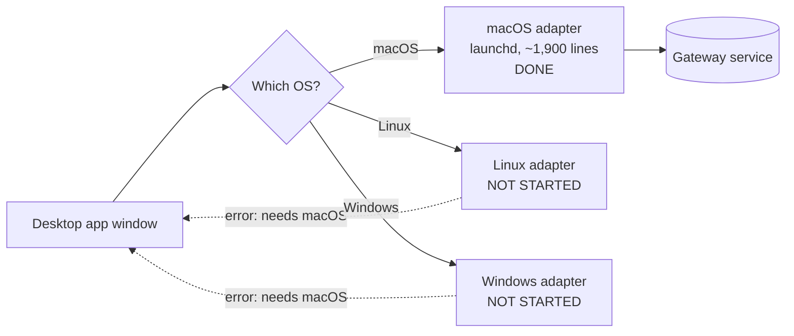
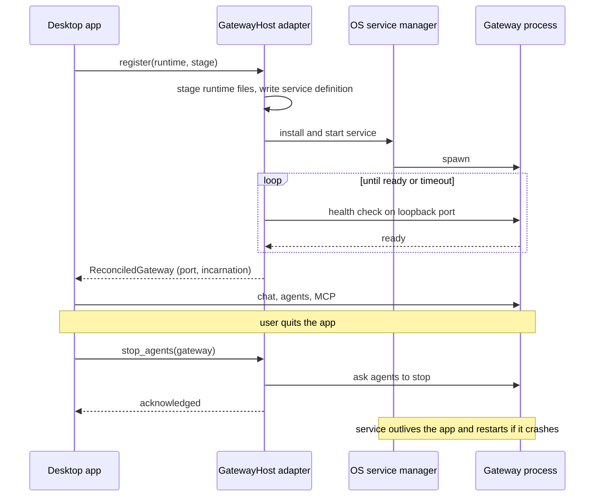
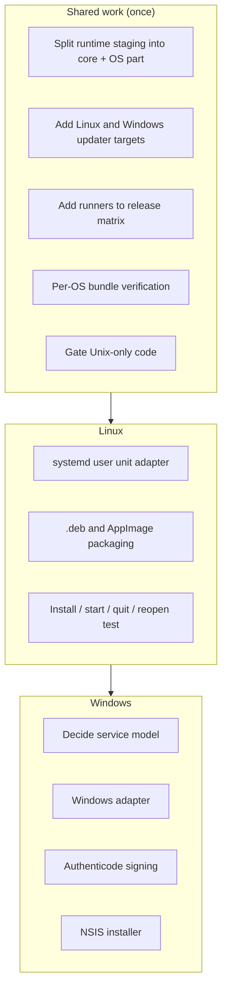
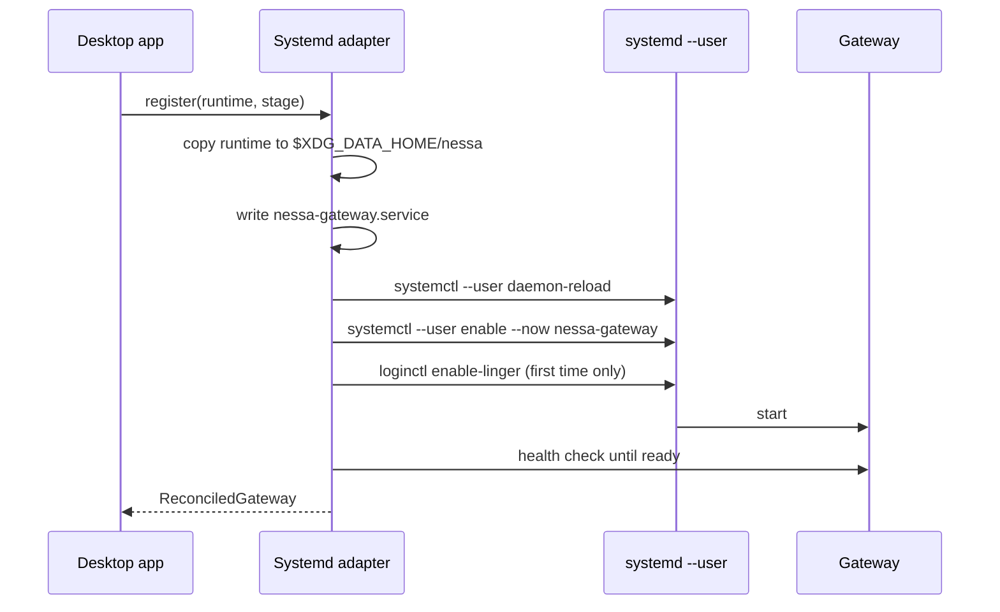
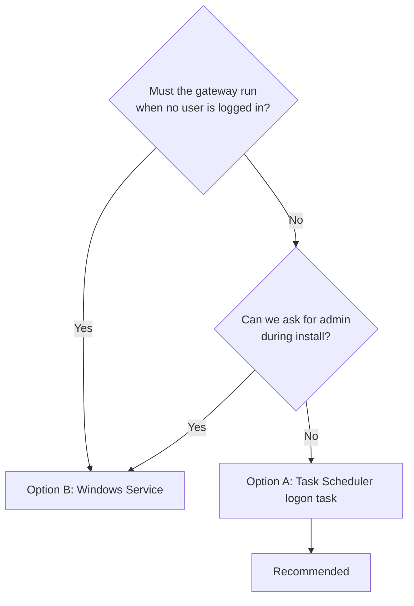
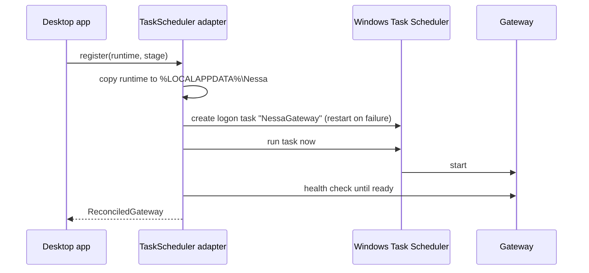

# Plan: ship the desktop app on Linux and Windows

Status: TODO. macOS is done. Linux and Windows are not started.

This plan is written in plain language so anyone on the team can follow it.
Diagrams use Mermaid and render on GitHub.

## 1. Where we are today

The desktop app opens on all three systems. But only macOS can run the
**gateway**, the background service that agents talk to. On Linux and Windows
the app compiles, then says "Bundled gateway services currently require macOS"
and stops there.

The four things that are macOS-only right now:

| Piece | What it does | Where |
| --- | --- | --- |
| Gateway host adapter | Installs, starts, checks, and retires the background service | `src-tauri/src/gateway/infrastructure/macos/` |
| Runtime staging | Downloads Node, builds the CLI tools, packs them into the app | `scripts/desktop/prepare-macos.mjs` |
| Release plumbing | Builds, signs, and publishes the app and the update feed | `scripts/desktop/release-assets.mjs`, `.github/workflows/release.yml` |
| Bundle check | Proves the built app is signed and safe to ship | `scripts/desktop/verify-bundle.mjs` |

## 2. What the gateway lifecycle looks like

This is the contract every platform has to keep. The app asks the host adapter
to **register** a runtime. The adapter hands it to the OS service manager, waits
until the service answers on localhost, and reports back. On quit the app asks
the adapter to **stop agents**, and the service keeps running on its own.

Only the two boxes on the right change per platform. The two on the left stay
the same.

## 3. Shared work (needed by both Linux and Windows)

Do these once. Linux uses them first, Windows reuses them.

1. **Per-platform runtime staging.** Split `prepare-macos.mjs` into a shared
   core plus a small OS-specific part. The core downloads that OS's Node,
   builds `nessa` and `nessa-mcp`, installs the claude-acp harness, fingerprints
   everything, and writes the manifest. Only the signing step differs by OS.
2. **Updater manifest for more targets.** `RELEASE_TARGETS` lists two Darwin
   triples today. Add `x86_64-unknown-linux-gnu` and `x86_64-pc-windows-msvc`,
   and make `releaseTarget()` map them to `linux-x86_64` and `windows-x86_64`.
3. **Release workflow matrix.** Add `ubuntu-latest` and `windows-latest` rows
   to the build matrix. The `--bundles app,dmg` flag becomes per-row.
4. **Bundle verification per OS.** `verify-bundle.mjs` only knows Apple tools.
   Give each OS its own check, or make the Apple check macOS-only.
5. **Unix-only code in the shared adapter.** Move `OpenOptionsExt` mode bits
   and `/bin/launchctl` calls behind OS gates so Windows compiles.

## 4. Linux

Linux is the easy one. **systemd user units** work almost exactly like launchd,
so the macOS adapter design carries over.

What to build:

- A `Systemd` adapter that writes a unit file under
  `~/.config/systemd/user/`, runs `systemctl --user daemon-reload`, then
  `enable --now`. Health checks reuse the existing loopback logic.
- Run `loginctl enable-linger` once so the service keeps running after the user
  logs out. This matches the "service outlives the app" rule.
- Use XDG paths (`$XDG_DATA_HOME`, `$XDG_RUNTIME_DIR`) instead of macOS
  `~/Library` paths.
- Package as `.deb` and AppImage. Declare WebKitGTK as a runtime dependency.
- No code signing is required on Linux.

Done when: fresh Ubuntu machine, install the `.deb`, open the app, chat works,
quit, reopen, chat still works, log out and back in, gateway still running.

## 5. Windows

Windows is harder because it has **no per-user service manager** like launchd or
systemd. We have to pick one of three models before writing code.

| Option | Survives logout | Auto-restart on crash | Needs admin | Fits current design |
| --- | --- | --- | --- | --- |
| A. Task Scheduler logon task | No | Yes, with retry settings | No | Good |
| B. Real Windows Service | Yes | Yes | Yes, at install | Best, but admin prompt |
| C. App supervises child process | No | Only while app is open | No | Weak |

**Recommendation: Option A** (Task Scheduler). It needs no admin, restarts the
gateway on crash, and outlives the app window. Losing the service at logout is
acceptable because the app is per-user anyway. Option B is a fallback if users
ask for always-on.

What to build:

- Decide the model (above) and write it down in this doc.
- A `TaskScheduler` adapter that uses `schtasks` or the Task Scheduler COM API
  to register a logon task, start it, and health-check on loopback.
- Windows paths: `%LOCALAPPDATA%\Nessa` for runtime and evidence.
- Replace file-mode bits and `launchctl` calls with Windows equivalents.
- **Authenticode signing.** Buy or provision a code-signing certificate, run
  `signtool` with a timestamp server, and sign the nested runtime binaries
  (Node, `nessa.exe`, `nessa-mcp.exe`) as well as the installer. Same shape of
  work as the Apple notarization already done.
- Package with the NSIS installer Tauri already supports.

Done when: fresh Windows 11 machine, run the signed installer without
SmartScreen warnings, open the app, chat works, quit, reopen, chat still works,
kill the gateway process, it comes back on its own.

## 6. Order of work

```mermaid
gantt
    title Rollout order
    dateFormat  X
    axisFormat %s
    section Shared
    Staging split, updater targets, matrix   :s1, 0, 3
    Per-OS verification, gate Unix code      :s2, after s1, 2
    section Linux
    systemd adapter                          :l1, after s2, 3
    Packaging and end-to-end test            :l2, after l1, 2
    section Windows
    Service model decision                   :w1, after s2, 1
    Adapter and signing                      :w2, after l2, 4
    Installer and end-to-end test            :w3, after w2, 2
```

Linux first. It proves the shared staging and release pieces with the least new
design. Windows second, because it needs a lifecycle decision and a signing
setup before any adapter code is useful.

## 7. Already cross-platform (no work needed)

`nessa-auth`, `nessa-server`, `nessa-sdk`, and `nessa-local-storage` already
build and test on Windows and Ubuntu in the `local-auth` CI job, including a
Windows private-files smoke test. The server and auth layers are fine. Only the
desktop host is missing.

## 8. Checklist

- [ ] Shared: split runtime staging into core + OS parts
- [ ] Shared: add Linux and Windows updater targets and manifest keys
- [ ] Shared: add `ubuntu-latest` and `windows-latest` to the release matrix
- [ ] Shared: per-OS bundle verification
- [ ] Shared: gate Unix-only code in the gateway adapter
- [ ] Linux: `Systemd` adapter with linger and XDG paths
- [ ] Linux: `.deb` and AppImage packaging with WebKitGTK deps
- [ ] Linux: end-to-end install / start / quit / reopen / logout test
- [ ] Windows: record the service model decision
- [ ] Windows: `TaskScheduler` adapter
- [ ] Windows: Authenticode certificate and `signtool` in CI
- [ ] Windows: NSIS installer and end-to-end test
- [ ] Update `docs/guides/gateway-chat.md` with the new platform sections

Related: [Linux desktop packaging](linux-desktop-packaging.md).
