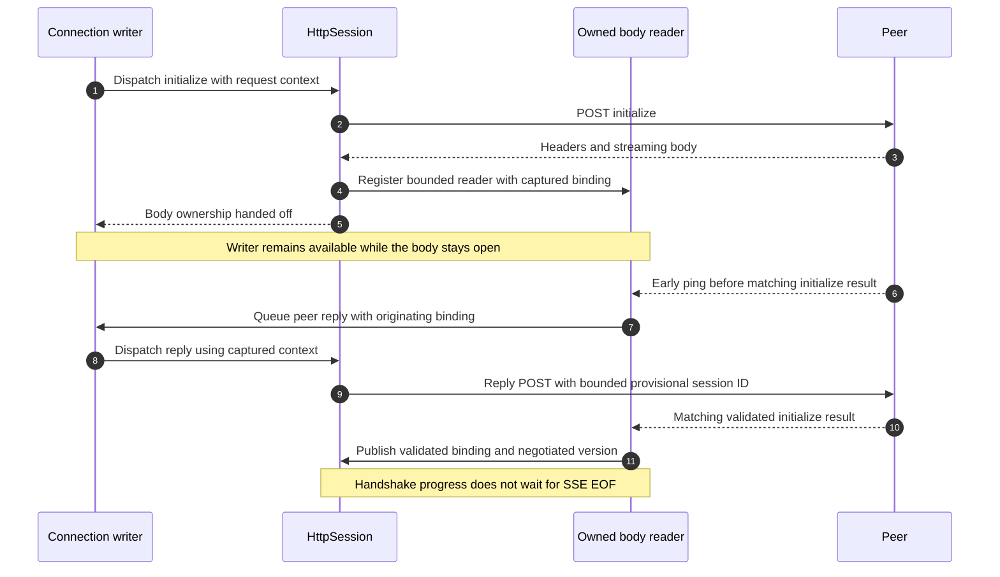
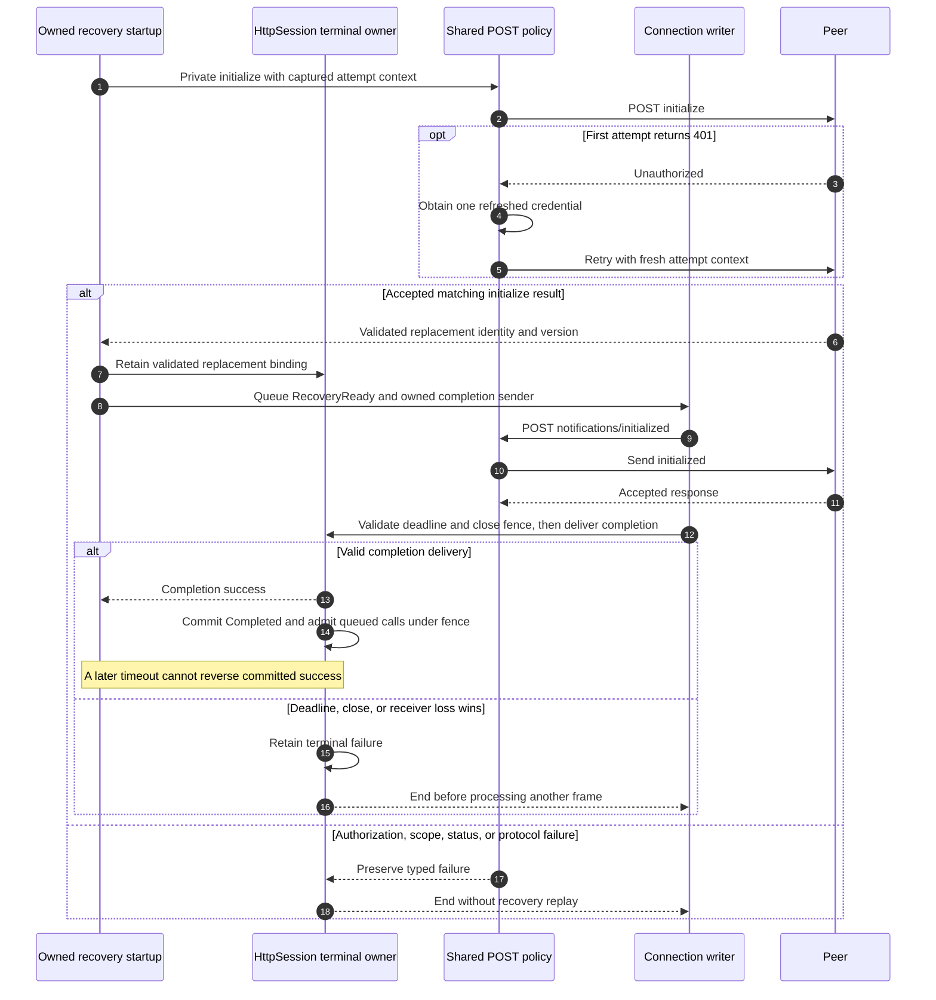
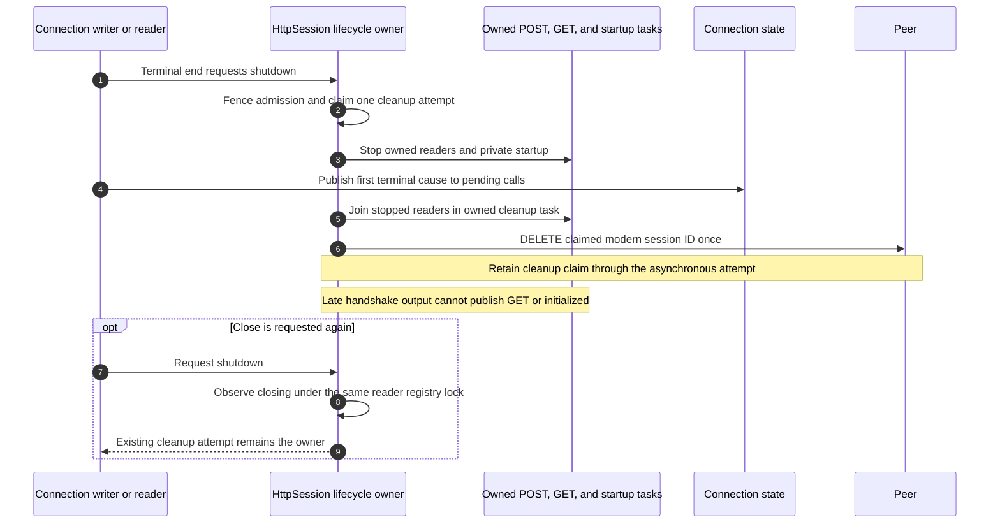

## Problem and behavior

A remote MCP peer could hold a JSON body or initialization stream open, blocking cancellation and later frames. Recovery could also report success before its replacement handshake was safely delivered, or race close and repeat DELETE.

This PR moves response bodies and private recovery startup into bounded, owned readers. The existing writer continues processing cancellation and peer replies. A matching, validated initialization result advances the handshake without waiting for SSE EOF. Recovery admits ordinary calls only after `notifications/initialized` is accepted and its completion is delivered under the terminal fence.

Closes #623
Closes #626
Closes #634
Closes #636

## Body progress and early peer replies

Peer replies carry the immutable binding and protocol context captured from the originating HTTP response. A provisional session-ID claim allows an early ping answer; it does not publish initialization success or admit ordinary work. Stale bindings, conflicting claims, and oversized authoritative IDs are refused. A peer reply's ID never becomes a pending caller's ID.

One JSON/SSE policy preserves neighboring responses. A completed body missing its own terminal response fails its own request explicitly. Ordinary request failures remain separate from connection-terminal failures.

## Recovery, shared HTTP policy, and admission

Private recovery initialization uses the same POST authorization/status policy as other modern requests: one credential retry after 401, scope observation for 403, and typed `Unauthorized`, `Unconfirmed`, or `SessionExpired` failures. It cannot enable legacy fallback. Each retry retains the context of the actual attempt, so publishing a replacement cannot reinterpret an earlier stateless response.

Bound peer-answer 404 ends with `SessionExpired`; stateless peer-answer 404 ends with a malformed HTTP-status error. Neither replays the answer or starts another recovery. Ordinary bound-call 404 retains its supported recovery path.

## Terminal ownership and close

The latest correction closes the HTTP owner when the connection writer or reader reaches a terminal end. Sealing only the connection's pending calls left a private startup capable of admitting a late effect. The existing HttpSession shutdown fence now owns that cleanup; no additional controller or public API is introduced.

This terminal path does not apply to an ordinary `FailCall`: its healthy neighboring calls and legitimate recovery control continue.

## Verification and merge status

Current head is `088b7c3d1db5adc31b3631bd976b5c252595bfef`, based on main's merged #656 (`aa774e05`). The last correction puts the once-only cleanup guard inside the existing reader-registry closing fence. Every shutdown caller observes that fence before returning, while one caller owns the asynchronous cleanup and DELETE. A deterministic owning-boundary regression models the old reachable paused-cleanup state, then checks refusal of valid late initialize publication, unchanged identity/readiness, no GET/POST, and typed Closed dispatch. Its single-DELETE positive control remains accepted.

The exact guard-order revert fails at runtime (one failed test, exit101); the restored final source passes (one passed, exit0). The fixed-source full MCP filter passed216 tests with one existing isolated child case ignored. There are18 meaningful runtime failure/restored-pass owner probe pairs overall:15 binding/policy,2 writer/reader terminal lifetime,1 overlapping-shutdown fence. Incorrect witness/compiler/setup attempts are retained and excluded.

Current-source formatting, selected six-package all-target Clippy with warnings denied, architecture tests, and architecture check pass. Final-source HTTP/MCP/grouped tests, SDK documentation, scripted Chromium/WebKit checks, fresh independent follow-up review, and current-head CI are being completed. Earlier a2f full-suite/browser/hosted passes remain historical evidence rather than approval of088b.

Five original review rounds and the user-approved narrow exception remain recorded. Two fresh whole-diff follow-up reviewers found the overlapping-shutdown major defect at a2f; the minimal correction above addresses it, and final review remains pending. CodeRabbit completed its a2f review with no actionable comments. The original early-reply and shared-policy findings have implementation-specific replies. The separate minor saturated peer-reply case is documented and explicitly deferred to #665 under the user's instruction to document minor findings and merge without broadening this PR.

#631 was completed independently and is no longer pending work in this PR. No Markdown-only cleanup is included.

## Scripted gateway checks

`pnpm test:e2e:scripted -- --channel bundled` passed on `a2fdb80f`, in dev/columns with real Chromium and WebKit and the gateway binary built from that source: MCP Apps16/16, gateway-window13/13, scripted-scenarios8/8. [Evidence directory](https://github.com/nessalabs/nessa-agent/tree/63e41ed7123f9fbe696fbdc42088437a7852b9f4/verification/desktop/evidence/mcp-http-progress/final-a2fdb80f/gates/scripted-browser-rerun), [source and runtime attribution](https://github.com/nessalabs/nessa-agent/tree/63e41ed7123f9fbe696fbdc42088437a7852b9f4/verification/desktop/evidence/mcp-http-progress/final-a2fdb80f/gates/browser-environment.json), and [independent review reports](https://github.com/nessalabs/nessa-agent/tree/63e41ed7123f9fbe696fbdc42088437a7852b9f4/verification/desktop/evidence/mcp-http-progress/final-a2fdb80f/gates).

Verdict: pass

| Check | Chromium | WebKit |
| --- | --- | --- |
| mcp-apps-gateway | pass | pass |
| gateway-window | pass | pass |
| scripted-scenarios | pass | pass |

Relevant log lines:

- console: requestfailed: http://127.0.0.1:37443/browser/check net::ERR_ABORTED (aborted after a 204 response, #485) (harmless)

An earlier same-source run caught one Chromium `/mcp-resources` navigation abort; that failed attempt is retained alongside the successful full rerun. Initial stale UI dependency/missing WebKit library setup failures are also retained. The browser used the correct pinned UI dependency and an unprivileged GLES library; only ldconfig-based host preflight was bypassed, and the real WebKit engine and assertions ran. Signed-in providers, physical WKWebView, and performance measurements are excluded.

**Current correction:** the overlapping-shutdown guard/fence correction is pushed at088b. Final verification and fresh review are underway. The a2f passes above are historical source-specific evidence, not approval of088b. The minor saturated-reply finding is documented separately in #665 under the user-authorized follow-up scope.
