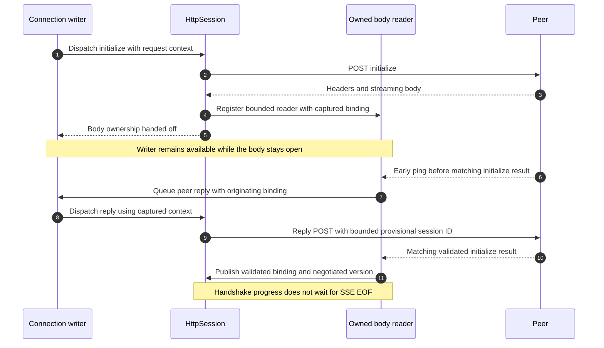
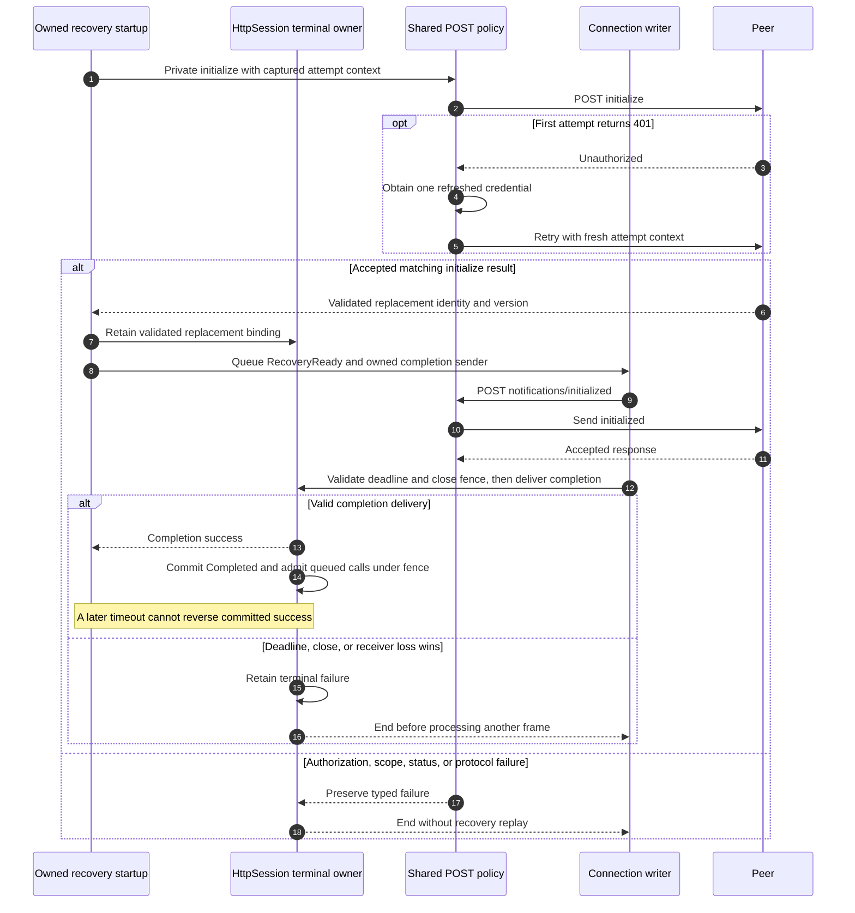
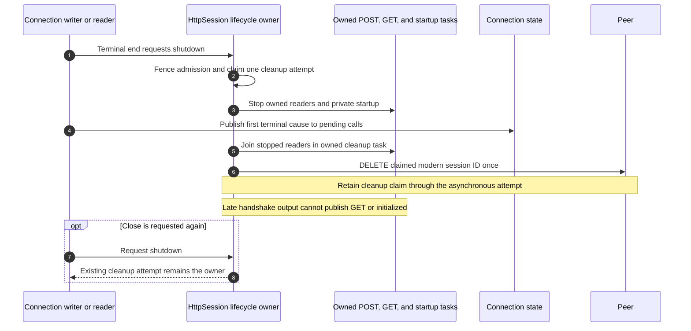

## Problem and behavior

A remote MCP peer could hold a JSON body or initialization stream open, blocking cancellation and later frames. Recovery could also report success before its replacement handshake was safely delivered, or race close and repeat DELETE.

This PR moves response bodies and private recovery startup into bounded, owned readers. The existing writer continues processing cancellation and peer replies. A matching, validated initialization result advances the handshake without waiting for SSE EOF. Recovery admits ordinary calls only after `notifications/initialized` is accepted and its completion is delivered under the terminal fence.

Closes #623
Closes #626
Closes #634
Closes #636

## Body progress and early peer replies

Peer replies carry the immutable binding and protocol context captured from the originating HTTP response. A provisional session-ID claim allows an early ping answer; it does not publish initialization success or admit ordinary work. Stale bindings, conflicting claims, and oversized authoritative IDs are refused. A peer reply's ID never becomes a pending caller's ID.

One JSON/SSE policy preserves neighboring responses. A completed body missing its own terminal response fails its own request explicitly. Ordinary request failures remain separate from connection-terminal failures.

## Recovery, shared HTTP policy, and admission

Private recovery initialization uses the same POST authorization/status policy as other modern requests: one credential retry after 401, scope observation for 403, and typed `Unauthorized`, `Unconfirmed`, or `SessionExpired` failures. It cannot enable legacy fallback. Each retry retains the context of the actual attempt, so publishing a replacement cannot reinterpret an earlier stateless response.

Bound peer-answer 404 ends with `SessionExpired`; stateless peer-answer 404 ends with a malformed HTTP-status error. Neither replays the answer or starts another recovery. Ordinary bound-call 404 retains its supported recovery path.

## Terminal ownership and close

The latest correction being verified closes the HTTP owner when the connection writer or reader reaches a terminal end. Sealing only the connection's pending calls left a private startup capable of admitting a late effect. The existing HttpSession shutdown fence now owns that cleanup; no additional controller or public API is introduced.

This terminal path does not apply to an ordinary `FailCall`: its healthy neighboring calls and legitimate recovery control continue.

## Verification and merge status

Published source `c68b4e40` passed all required hosted checks, including Linux, macOS, Windows, and SDK domain coverage. Its focused HTTP progress tests passed 46 cases; the full MCP filter passed 203 with one intentionally isolated child-process case ignored while its parent enforcer ran.

The remaining preterminal race is reproduced: a stale request ends the connection, but the old HTTP owner still accepts a late notification. The ordinary-terminal positive control passes. The branch is now restacked onto main's merged #656 (`aa774e05`); the minimal terminal-owner correction passes the two focused preterminal regressions, while final checks and fresh independent review are in progress. Earlier successful CI is not claimed for unpublished changes.

All 15 existing binding/policy owner probes have real assertion-failure and restored-pass evidence. Earlier review rounds remain recorded; the user-approved exception allows finishing the confirmed findings with focused corrections and fresh review. The two original external findings are implemented by the binding and shared-policy changes and will receive final verification-specific replies.

Prior signed-out Chromium/WebKit evidence belongs to `00ebdc43`. Fresh scripted browser verification on the final assembled source remains required before merge. Live provider credentials, native WKWebView, rollback of remote tool effects, and performance claims are outside that evidence.

#631 was completed independently and is no longer pending work in this PR. No Markdown-only cleanup is included in the remaining correction.
