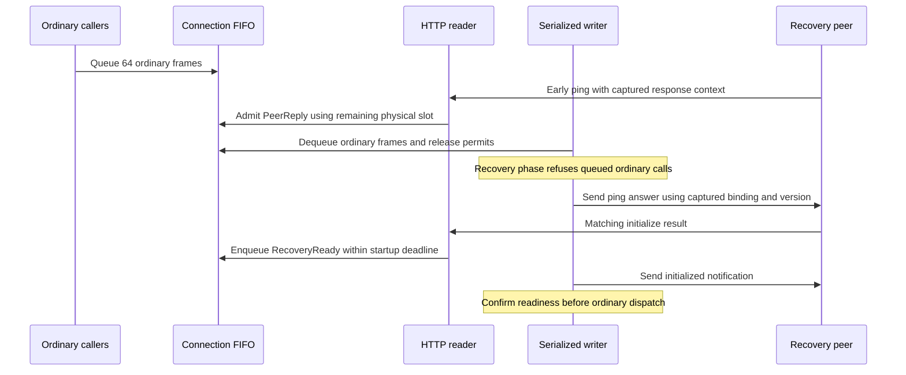
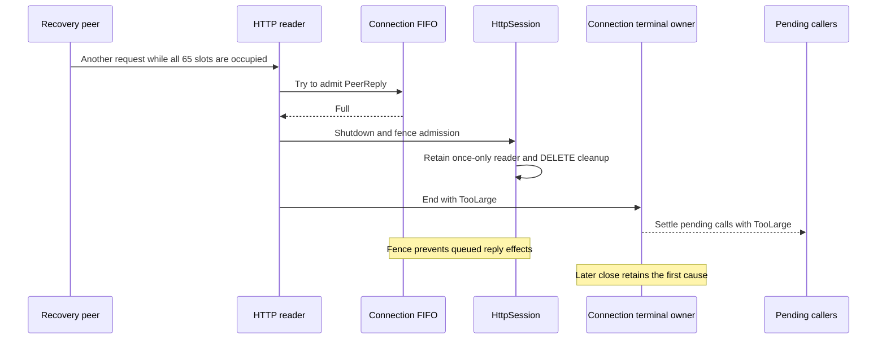

## Problem and behavior

During HTTP session recovery, 64 queued ordinary frames could fill the outgoing queue and silently discard an early peer `ping` reply. A peer waiting for that answer could then withhold its initialize result until recovery timed out.

This change keeps one serialized FIFO with 64 ordinary-frame permits and 65 physical slots for HTTP. Peer replies and `RecoveryReady` bypass ordinary permits, so ordinary saturation leaves room for a control message. Permits release when the writer dequeues a frame. Controls retain FIFO order and may use other free slots; the reserve does not promise priority or progress under control saturation. Stdio retains its existing 64-slot behavior.

If controls exhaust all physical capacity, peer-answer admission returns typed `TooLarge` through the existing reader shutdown fence and first-cause owner. A closed queue uses its retained terminal cause or `ServerGone`. Recovery deadlines, cancellation, captured response binding, and once-only cleanup remain owned by the existing session.

## Verification

Initial author checks passed: formatting, six-package all-target Clippy with `-D warnings`, HTTP progress (56 passed), and full MCP (221 passed, zero failures, one existing ignored test). Six deliberate rule mutations produced failing runtime regressions, followed by a successful restored HTTP progress run. Broader suite checks, independent review, browser evidence, and hosted CI are being assembled; final exact-head results will be recorded before merge.

ADR 392 ordering rows J21–J26 cover saturated recovery answers, matching initialization before drain, control overflow/closure, permit release/cancellation, deadline expiry, and close or writer failure before dispatch. Regressions reuse the existing in-process HTTP fixtures; no subprocess fixture is added.

A custom HTTP adapter unwind can separately leave writer loss without immediate terminal publication; that confirmed adjacent gap is tracked in #670 and is outside this queue admission fix.

Closes #665.
