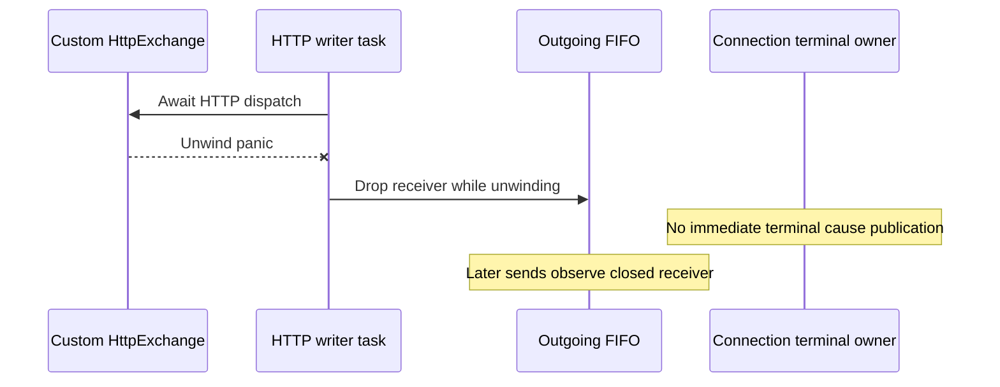

A panic from a custom `HttpExchange::exchange` adapter can unwind the HTTP writer task before it publishes a connection terminal cause. `Connection::open_http` spawns the writer and awaits dispatch directly; its `SendOutcome::End` branch fences the session and calls `Shared.end`, but an unwind bypasses that branch. The connection retains the task handle without observing its panic immediately.

The deterministic `j23_closed_control_queue_is_explicit` regression added while fixing #665 gates a custom exchange, injects an unwind panic, and observes `notify` return `ServerGone` from the closed writer queue while `end_cause()` remains `None`. A later peer request terminates the connection through #665's explicit closed-control admission handling. Without that later input, terminal notification and cleanup depend on other paths or the recovery budget rather than the lost task itself.

Production owners: `crates/nessa-sdk/src/infrastructure/mcp/connection.rs`, `Connection::open_http`; public substitution seam: `crates/nessa-sdk/src/infrastructure/mcp/http_exchange.rs`, `HttpExchange::exchange`. This path exists on merged main `b228750b5f8fe4582e8480ee8264de9f9d498b26`; #665 does not add writer panic supervision.

Acceptance:

- Design writer-loss ordering in the existing lifecycle owner before changing code; avoid a second terminal cause authority.
- Under unwind behavior, observe writer task failure, fence HTTP admission, publish a typed terminal cause once, and preserve cleanup ownership without waiting for another incoming peer request.
- Test custom-adapter panic with no subsequent input, competing explicit close, pending calls and recovery, retained first cause, reader joins, and once-only DELETE.
- Preserve valid dispatch and supported platform behavior; use in-process fixtures.

Limits: this reproduction demonstrates a panic in a custom adapter, not the built-in HTTP adapter. It does not cover `panic=abort`, which terminates the process. This is a separate follow-up, outside #665's bounded queue admission change.
