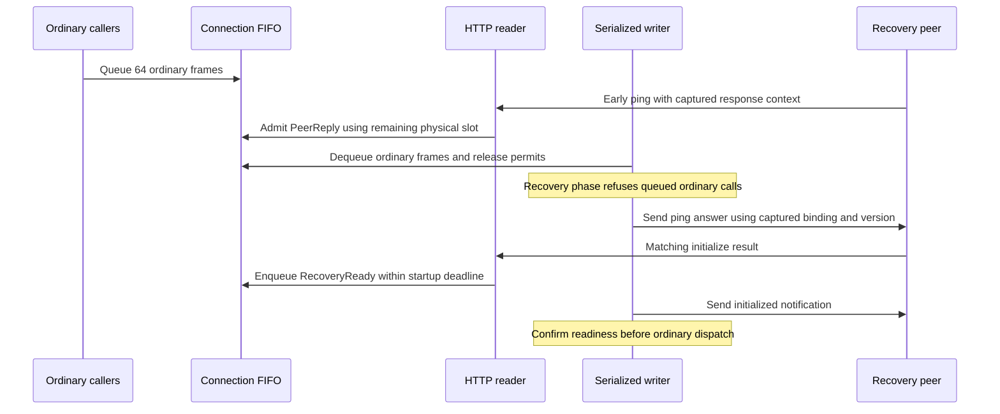
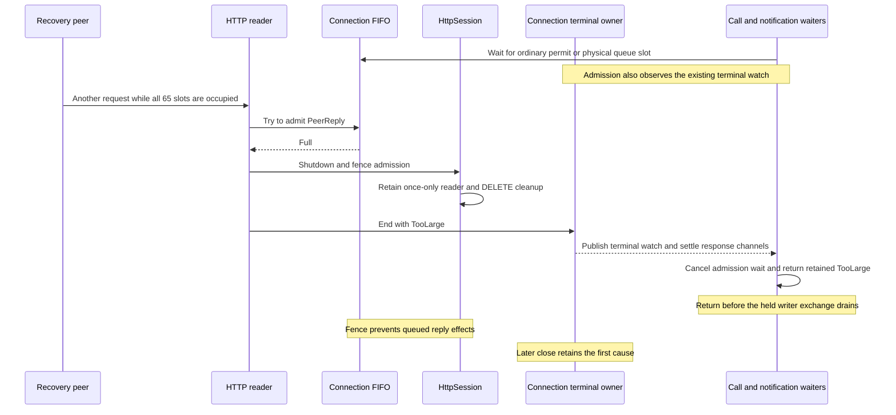

## Problem and behavior

During HTTP MCP recovery, 64 ordinary frames could fill the outgoing queue and cause an early peer request to lose its answer. This could stall initialization until its budget expired. The connection now retains one FIFO with 64 ordinary permits and one additional HTTP control slot. PeerReply and RecoveryReady use control capacity; stdio keeps its existing 64-frame bound.

Ordinary permits release at dequeue, canceled admission, failed sends and receiver teardown. Controls retain FIFO order; the reserve does not promise priority or unlimited progress under control pressure. Captured reply identity/version and the existing recovery deadline remain authoritative.

If controls exhaust physical capacity, admission returns typed TooLarge through the existing HTTP shutdown fence and Shared first-cause owner. A closed queue uses the retained cause or ServerGone. Calls and notifications waiting for an ordinary permit or physical slot observe that same terminal owner, cancel their admission future and return the retained cause without requiring the held writer to drain.

Biased selection prioritizes an already-observed terminal cause; it does not make enqueue atomic with termination. The HTTP fence prevents downstream effects of a raced frame. This adds no terminal state, priority lane, controller, public API or subprocess fixture. ADR392 J21–J26 define the ordering and their test enforcers.

## Verification

Final source: `8f083e81e2c323c818cb51612c45edcef42c61b6`, base `d59d9272`.

- Full MCP: **222 passed**, zero failures, one existing ignored test.
- Selected six-package suite: **4,420 passed**, zero failures, 30 existing ignored/child probes across 25 successful verdicts.
- Format, six-package all-target Clippy with `-D warnings`, strict SDK docs, architecture checker and 74 architecture tests passed.
- The new live-waiter regression failed before the fix (exit101): ended reported TooLarge but the excess call timed out before the exchange was released. The corrected tests cover call and notification permit waits, physical waits after permit acquisition, already-ended empty queues, retained causes and prevented HTTP effects.
- Tests derive saturation workloads from the owning queue constants and poll past Tokio cooperative yields. Changing ordinary capacity to65 passed all56 then-current HTTP-progress tests; removing the reserve failed J21. Those earlier probe executions remain identified by their actual source variants.
- Six original queue/cause mutation probes produced real test failures (exit101), followed by restored56-test success. Their historical source is `ee798344`; current queue/deliver blocks are byte-identical, and the new terminal-admission rule has its separate failure-before-fix proof.

[Current raw evidence and source provenance](https://github.com/nessalabs/nessa-agent/blob/__EVIDENCE_COMMIT__/verification/desktop/evidence/mcp-peer-reply-capacity/terminal-admission-8f083e81/publication-manifest.json). Format/MCP/Clippy checked the exact final source bytes before commit creation; the broader suite, docs, architecture and browser checks ran on clean `8f083e81`. The manifest states both source identity and actual command-start Git state.

## Scripted browser summary

Supported umbrella verdict: **pass**, actual source `8f083e81`, dev mode, columns, real Chromium and WebKit.

| Group | Shared | Chromium | WebKit | Total |
| --- | --- | --- | --- | --- |
| MCP Apps | 2/2 | 7/7 | 7/7 | 16/16 |
| Gateway window | 1/1 | 6/6 | 6/6 | 13/13 |
| Scripted scenarios | — | 4/4 | 4/4 | 8/8 |

[Supported-run summary](https://github.com/nessalabs/nessa-agent/blob/__EVIDENCE_COMMIT__/verification/desktop/evidence/mcp-peer-reply-capacity/terminal-admission-8f083e81/author/scripted-browser/pr-summary.md) and raw results are published. Recorded benign line: `browser/check net::ERR_ABORTED (aborted after a 204 response, #485) (harmless)`. Only the ldconfig-cache host preflight was skipped for the recorded local browser libraries; real engines and assertions ran. This is headless WebKit, with no native WKWebView or production performance claim.

The images show the existing MCP App scope-refusal fixture exercised by this run; backend saturation behavior is established by the Rust regressions.

## Review and checks

Review history is retained: R1 import nit fixed, R2 clean, then GitHub Codex identified duplicated test workload and R3 was clean after correction. Its subsequent live-admission finding exposed a missing relationship between queue waiting and terminal publication. The structural correction connects ordinary admission to the existing owner and updates J23/J24 before code; no new termination controller was added.

Fresh R4 reviews on the complete final source are clean at every priority: [lifecycle](https://github.com/nessalabs/nessa-agent/blob/__EVIDENCE_COMMIT__/verification/desktop/evidence/mcp-peer-reply-capacity/terminal-admission-8f083e81/root/review-r4-lifecycle.md) and [protocol/resource/evidence](https://github.com/nessalabs/nessa-agent/blob/__EVIDENCE_COMMIT__/verification/desktop/evidence/mcp-peer-reply-capacity/terminal-admission-8f083e81/root/review-r4-protocol-evidence.md). Greptile declined due to expired trial; fresh independent local review supplies the standards' replacement. CodeRabbit's separate private/test docstring metric warning has a documented disposition; strict SDK documentation passed.

[Current CI run](https://github.com/nessalabs/nessa-agent/actions/runs/37759000833) and current-head CodeRabbit/Codex reviews are tracked before merge. Prior-head CI successes are historical evidence.

Separate follow-up [#670](https://github.com/nessalabs/nessa-agent/issues/670) tracks prompt writer-panic supervision for custom adapters; this PR covers bounded admission and explicit full/closed queue outcomes.

Closes #665
