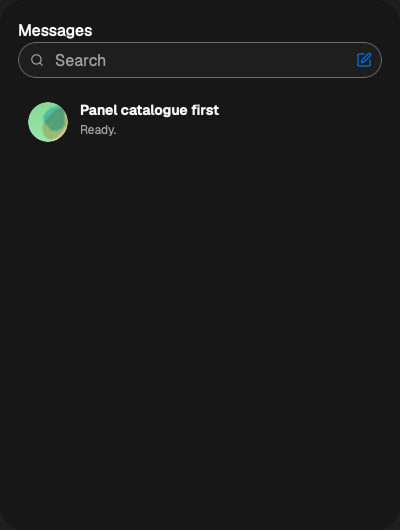
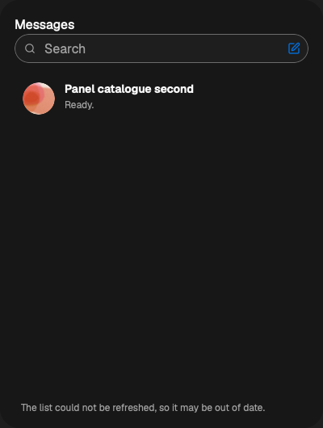

# Unblocked panel Messages catalogue follow (#722)

Measured source: `9f63243e36181625786fa332398152825c220e3e`, based on main
`965797a9f2cb1a71923f32eee4197aa501669ebf`, macOS arm64, headed bundled
Chromium and Playwright WebKit, production ConversationList and effects/store
against a rebuilt private real gateway with a scripted ACP provider. This is a
panel fixture served in dev, not native WKWebView or production performance.

Both fixed runs: `panel-list-follow: 3/3 held`.

```
ok    console
ok    external-catalogue-and-cleanup [chromium]
ok    external-catalogue-and-cleanup [webkit]
```

Each engine records two target opens throughout external create/archive/undo/delete,
zero one-shot reads, two closes on hiding and four total opens after reopening.
A controlled archived-port failure stays visible while a real active-list update
arrives. The archive evidence excludes a held tab. This deliberately injected
failure does not establish an actual gateway outage.

Exact main snapshot-only UI bytes are asserted in `main-ui-source.json` and the
revert diff. The same browser check fails before external update can be seen:

```
ERROR external-catalogue-and-cleanup [chromium]
        ! locator.waitFor: Timeout 30000ms exceeded.
ERROR external-catalogue-and-cleanup [webkit]
        ! locator.waitFor: Timeout 30000ms exceeded.
panel-list-follow: 1/3 held
```

The missing external row is the failing condition; only console held on that
baseline. Restoring the committed UI source returns both engines to passing.

598 neighboring unit tests and 164 browser-helper tests passed. Eleven individually
source-asserted owner/failure/cleanup rule mutations fail; the restored suite passes.
Schema listTargets2→1 is regenerated into both goldens: real S17 fails at archived
subscription with `subscription_capacity` (exit101). Restoring2 passes S17 and
rebuilds the correct gateway. Protocol check (56 tests), typechecks, scoped lint and
format, architecture and Rust fmt passed. Full combined run-all, scripted summary,
independent review and production performance remain the coordinator's gates.

The combined branch also fixes the devServerOnlyChecks registration omitted from
this isolated source; direct fixture acceptance does not verify production run-all
categorization. All author-owned processes ended after the restored final check.



