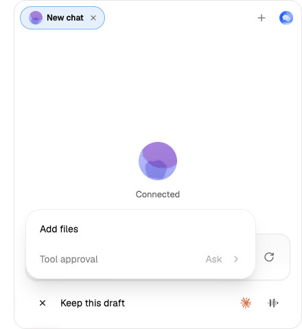
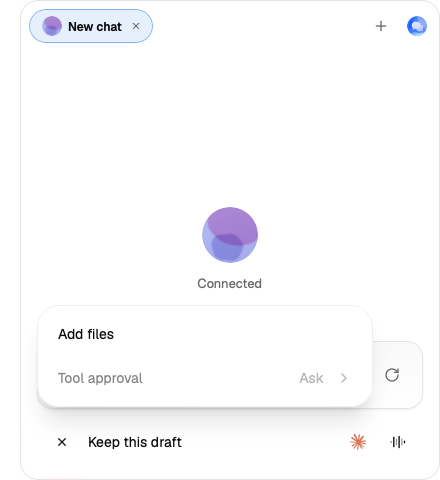

# Unblocked audit evidence

Checked production source: `9c1c672f2f20e39f63ff9745a32d6467259d328d`, assembled from main `965797a9f`. Current upstream at publication preflight is `88f34e4dabdeca46486dfbd5294e0a2a00a0a5fa`; merge-result compatibility remains a separate gate. The evidence commit changes no production or verification executable source.

- [Source-region identity](assembled-source-identity.json) records exact reuse boundaries and whole author/integration tree equality.
- [Current frontend](frontend-current-results.json): 3,998 tests / 307 files and complete frontend check pass.
- [Rust stages](rust-results.json): all twelve pass at bd8; the complete Rust region is byte-identical at this source.
- [API final review](api-review-round2.md), [native/SDK/OAuth review](native-review.md), [desktop review](desktop-review.md) retain their actual checked heads and exclusions.
- [Consumer author](consumer-author.md), [source manifest](consumer-source.json), [fresh independent review](consumer-review.md) cover the final #712 consumer delta.
- [Mode browser](consumer-mode-browser.json): two Chromium/WebKit consumer rows plus console row hold in one unchanged-script run; this is not three repeated trials. Both engines retain draft, refuse dispatch and disable mode controls on unavailable publication, then recover.
- [Earlier mandatory scripted run](scripted-bd8.md): PASS at bd8. A fresh run on the final cut is pending at initial publication.
- [Failed performance table](performance-bd8-failed.txt): 32/35 rows held at bd8. Three 50 ms frame-budget rows fail. Current-main baseline and final-cut performance/whole functional/retained-app checks remain pending; no merge readiness is claimed.

The screenshots show the actual unavailable state with retained draft and disabled Tool approval / Ask. No raw ACP traces, relay/session capabilities or provider credentials are included.

## Necessary follow-up source corrections

The initial pushed CI failed on all three platforms for the native test fixture's deprecated atomic helper. [Native compatibility correction](native-ci-compatibility/report.md) preserves Rust 1.85 and original fault-counter behavior, with independent source review, full host checks and a failing semantic removal probe. Its production prefix is unchanged.

The initial complete functional run at9c1 remains FAILED978/990; it is not relabelled. [Readiness author evidence](browser-readiness/author-report.md), [round1 P2 finding](browser-readiness/round1-review.md) and [fresh round2 closure](browser-readiness/round2-review.md) cover only three verification scripts and their existing sampling table. The scripts consume already-owned list/recorded-ghost/frame publication before unchanged geometry, bidi, focus and residue assertions. Targeted default matrices pass8+8+12; counts are separate from the old whole run. Final whole verification/current-head CI are still separate gates, and the 50ms performance gate remains failed33/35.

Latest source-qualified checkpoints: [final full browser990/990](final-browser-05bc/README.md) and [native publication test-gate correction](native-publication-waiters/README.md). These preserve their actual source heads, prior failures, the Windows CI disposition and the unchanged performance merge blocker.
